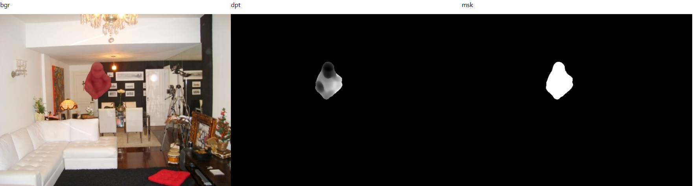
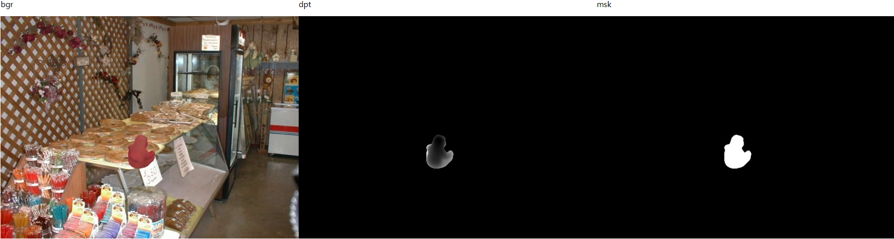
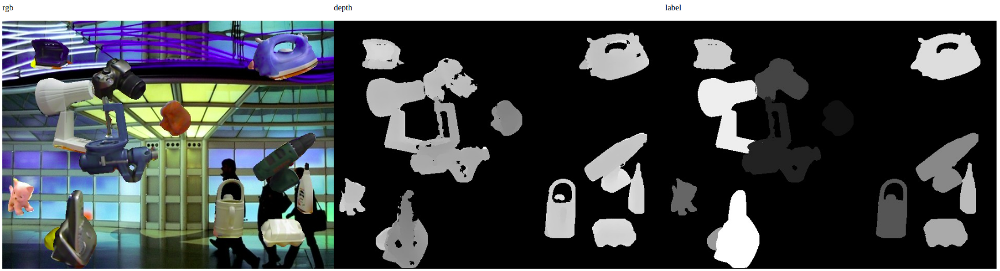
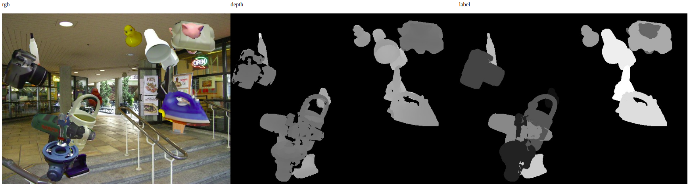

# Raster Triangle
This is a simple renderer with z-buffer for synthesis data generating. With an input mesh and its pose, the rendered RGB and depth map are generated. It has been applied to [PVN3D](https://github.com/ethnhe/PVN3D).

## Installation
Compile the source code by
```shell
chmod +x ./rastertriangle_so.sh
./rastertriangle_so.sh
```

## Datasets:
- Download the LineMOD dataset from [here](https://drive.google.com/drive/folders/19ivHpaKm9dOrr12fzC8IDFczWRPFxho7). Unzip it and link the unzipped folder to this folder:
    ```shell
    ln -s path_to_Linemod_preprocessed ./Linemod_preprocessed
    ```
- Download SUN2012pascalformat dataset from [here](http://groups.csail.mit.edu/vision/SUN/releases/SUN2012pascalformat.tar.gz). Unzip it and link the unzipped folder to this folder:
    ```shell
    ln -s path_to_SUN2012pascalformat ./
    ```
- Download the sample poses from [here](https://hkustconnect-my.sharepoint.com/:f:/g/personal/yhebk_connect_ust_hk/End-Ha7PuQFNktD_ZqBIuQgBwR0wNVDPi-Bneulo7Dy-JA?e=WQba57) and move the pickle files to folder ```sampled_poses/```.

## Generate synthesis data
- Generate rendered data. Sampled poses for each object are provided in ``sampled_poses/``, which are generated by scripts [here](https://github.com/zju3dv/pvnet-rendering). Run the following command to generate rendered data:
    ```shell
    python3 rgbd_renderer.py --help
    python3 rgbd_renderer.py --cls ape --render_num 70000
    ```
    Example rendered images are as follows:
    
    


- Run the following command to generate fusing data:
    ```shell
    python3 fuse.py --help
    python3 generate_fusing_data.py --cls ape --fuse_num 10000
    ```
    Example fused images are as follows:
    
    
